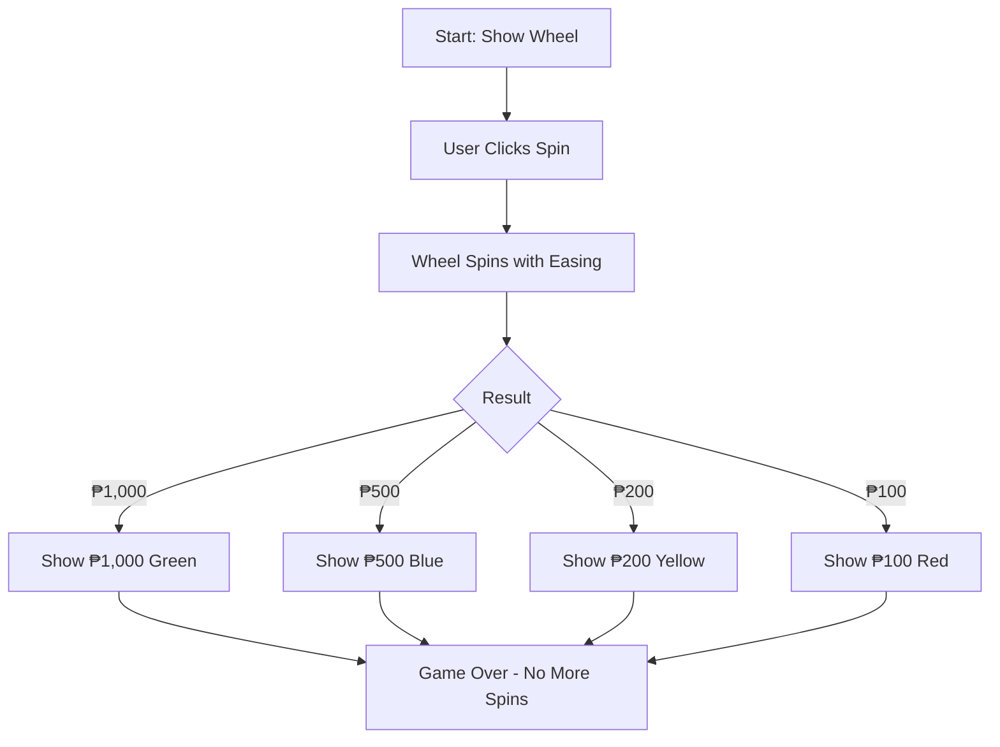

# Prize Wheel Game - Implementation Plan

## Overview

Transform the existing birthday surprise into a 4-segment color wheel with weighted probabilities. Users get ONE spin only.

## Wheel Design

### Segments & Colors

| Prize Amount | Color Name | Hex Code |
| ------------ | ---------- | -------- |
| ₱1,000       | Green      | #22c55e  |
| ₱500         | Blue       | #3b82f6  |
| ₱200         | Yellow     | #eab308  |
| ₱100         | Red        | #ef4444  |

### Probability Distribution

| Prize  | Probability | Cumulative |
| ------ | ----------- | ---------- |
| ₱1,000 | 50%         | 50%        |
| ₱500   | 20%         | 70%        |
| ₱200   | 20%         | 90%        |
| ₱100   | 10%         | 100%       |

## UI/UX Flow

## Animation Specification

### Spin Animation

- **Duration**: 3-5 seconds with deceleration (ease-out)
- **Rotations**: 5-8 full rotations before stopping
- **Final Position**: Calculated from weighted probability, then rotated to the top/12 o'clock position
- **Pointer**: Fixed triangle pointer at top indicating winning segment

### Wheel CSS Structure

- Circular wheel with 4 equal segments (90° each)
- Each segment contains the prize amount text
- Center hub with spin indicator
- Outer ring with tick marks for visual effect

## Files to Modify

### 1. index.html

- Replace button with wheel container
- Add pointer element
- Update message display area for result

### 2. index.css

- Add wheel styles (360° circle with conical-gradient or SVG)
- Add pointer styles
- Add spin animation keyframes
- Add result display styles

### 3. index.js

- Implement weighted random selection
- Add spin animation with requestAnimationFrame or CSS transition
- Display result after spin completes
- Disable further spins after first attempt

## Implementation Steps

1. **HTML**: Create wheel structure with 4 segments
2. **CSS**: Style the wheel with colors and animations
3. **JS**: Implement probability-based selection
4. **JS**: Execute spin animation to selected segment
5. **JS**: Display prize and disable replay
6. **Testing**: Verify one-time spin constraint

## Acceptance Criteria

- [ ] Wheel displays 4 distinct colored segments
- [ ] Click triggers single spin animation
- [ ] Weighted probability: ₱1,000 wins ~50% of the time
- [ ] Spin cannot be triggered again after first spin
- [ ] Result clearly displayed to user
